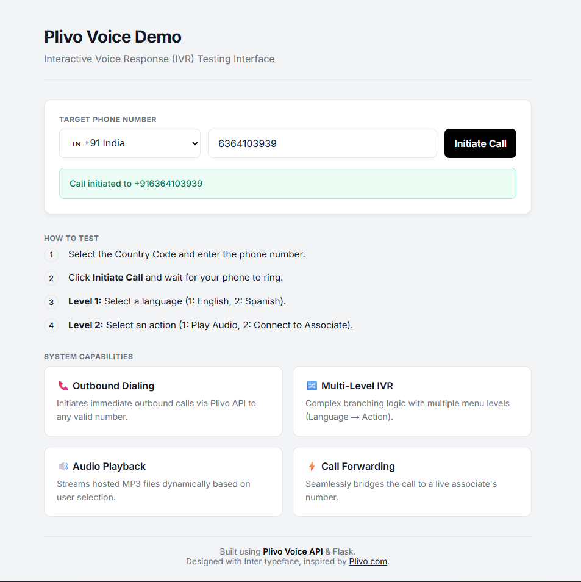

# Plivo Voice Demo 📞

A professional demo IVR system demonstrating Plivo's inbound/outbound voice capabilities with a Flask backend and a clean, responsive frontend.



## 🚀 Features
- **Outbound Dialing**: Instantly trigger calls to any number worldwide.
- **Multi-Country Support**: Dropdown with top 25 countries and flags (🇺🇸, 🇮🇳, 🇬🇧, etc.).
- **Interactive IVR**: Multi-level menu handling (Language Selection -> Action).
- **Live Call Logic**: Flask backend handling webhooks, DTMF inputs, and XML generation.
- **Responsive UI**: Neobrutalism-inspired, mobile-friendly interface built with standard HTML/CSS.

## 🛠️ Setup Instructions

### 1. Prerequisites
- Python 3.8+
- [ngrok](https://ngrok.com/download) (for local webhook testing)
- A Plivo Account.

### 2. Install Dependencies
```bash
pip install -r requirements.txt
```

### 3. Configure Environment
Create a `.env` file in the root directory (or use the one provided):
```env
# PLIVO CREDENTIALS
PLIVO_AUTH_ID=MANZJJOGRLNZK0ZMZIMM
PLIVO_AUTH_TOKEN=NmU2ZmRhMjYtOTE1OS00YWRiLWJlNmEtNTIxYzUy

# CALLER ID (Must be a Plivo Number or Verified Number)
PLIVO_PHONE_NUMBER=14692463987

# PUBLIC URL (Update this every time you restart ngrok)
NGROK_URL=https://your-ngrok-url.ngrok-free.app
```

### 4. Audio Assets
Ensure you have `english.mp3` and `spanish.mp3` in the `audio/` directory.

## 🏃‍♂️ How to Run

1.  **Start Ngrok**:
    ```bash
    ngrok http 5000
    ```
    *Copy the HTTPS forwarding URL.*

2.  **Update Config**: Paste the URL into the `NGROK_URL` field in your `.env` file.

3.  **Start the Server**:
    ```bash
    python app.py
    ```

4.  **Access the UI**: Open your browser to:
    > **http://localhost:5000**

## 🧪 Testing the Flow

## 🧪 Testing the Flow


1.  **Enter Number**: Select your country code (e.g., +91 for India) and enter your mobile number.
2.  **Click Call**: The system will initiate a call via Plivo API.
3.  **Listen & Interact**:
    -   *System*: "Welcome to Inspire Works. Press 1 for English..."
    -   *You*: Press `1`.
    -   *System*: "Press 1 to play audio, 2 to talk to associate."
    -   *You*: Press `1` (Plays MP3) or `2` (Dials Associate).

## 📂 Project Structure
- `app.py`: Main Flask application handling routes and Plivo XML logic.
- `templates/index.html`: The responsive frontend interface.
- `audio/`: Folder for IVR voice prompts/music.
- `requirements.txt`: Python package dependencies.


## Project Structure

- `app.py`: Main application logic and IVR flow endpoints.
- `.env`: Environment variables/Secrets.
- `requirements.txt`: Python dependencies.
- `audio/`: Directory for audio files.

